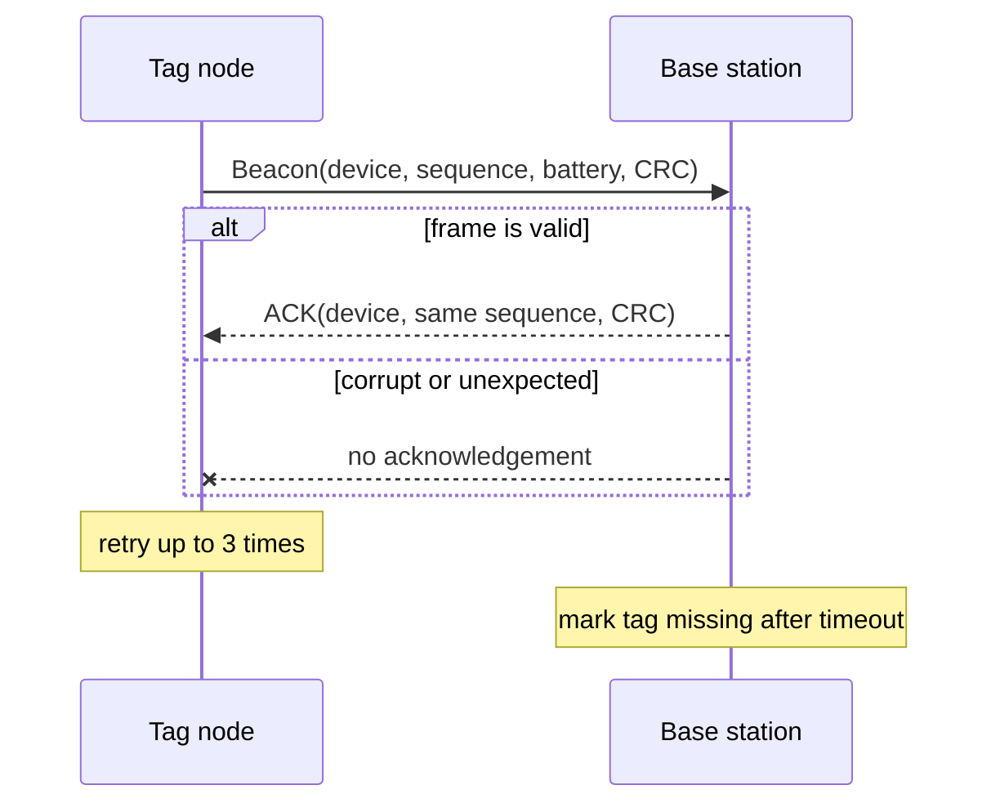

# RF Asset Finder

[](https://github.com/mjumair7/rf-asset-finder/actions/workflows/ci.yml)

A small 433 MHz asset-presence experiment I built to learn what a radio link needs beyond simply sending bytes. The protocol uses explicit framing, CRC-16 validation, sequence numbers, acknowledgements, retries, and timeouts.

The repository has two layers:

- `src/` is a portable C++17 protocol and base-station tracker that can be tested on any computer.
- `firmware/` contains Arduino sketches for a tag and a base station using the RadioHead `RH_ASK` driver.



## Try the desktop simulation

```sh
make demo
make test
```

The demo feeds three tags into the tracker, advances the clock, and reports the tag that crossed its timeout boundary. The tests cover encoding, CRC rejection, packet-type validation, duplicate sequence rejection, and timeout state.

## Packet format

| Field | Bytes | Notes |
| --- | ---: | --- |
| Magic | 2 | `RF` |
| Version | 1 | Protocol version 1 |
| Type | 1 | Beacon or acknowledgement |
| Device ID | 2 | Big-endian tag identifier |
| Sequence | 2 | Used to reject stale data and ACKs |
| Payload length | 1 | Maximum 16 bytes |
| Payload | 0–16 | Battery voltage or future telemetry |
| CRC-16/CCITT | 2 | Covers every preceding byte |

The tag only accepts an ACK when its device ID, sequence number, length, and CRC all match the beacon it just sent.

## Hardware notes

The example sketches assume one transmitter and one receiver on each node so the base can acknowledge a beacon. Pin assignments, antenna length, and logic-voltage compatibility must be checked for the specific modules and microcontroller.

Cheap ASK modules are noisy. The protocol can detect corruption, but it does not provide encryption, collision avoidance, or reliable ranging. The Arduino sketches still need to be tested with the exact radios, antennas, and power supply used in a physical build. Sequence-number rollover and multi-tag contention are known next steps.

## Dependencies

- Desktop simulation: a C++17 compiler and `make`
- Arduino sketches: Arduino IDE or PlatformIO plus RadioHead

MIT licensed.
